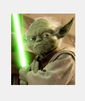

# React Konva

React Konva is a JavaScript library for drawing complex canvas graphics using [React](https://reactjs.org/)

It provides declarative and reactive bindings to the [Konva Framework](https://konvajs.org/).

# picture Demo

**How To create an image with react-Konva ?**

**use use-image hooks.**

**version:0.1.0**

**[Sandbox Link](https://codesandbox.io/s/ox106pyo65?file=/src/index.js)**
